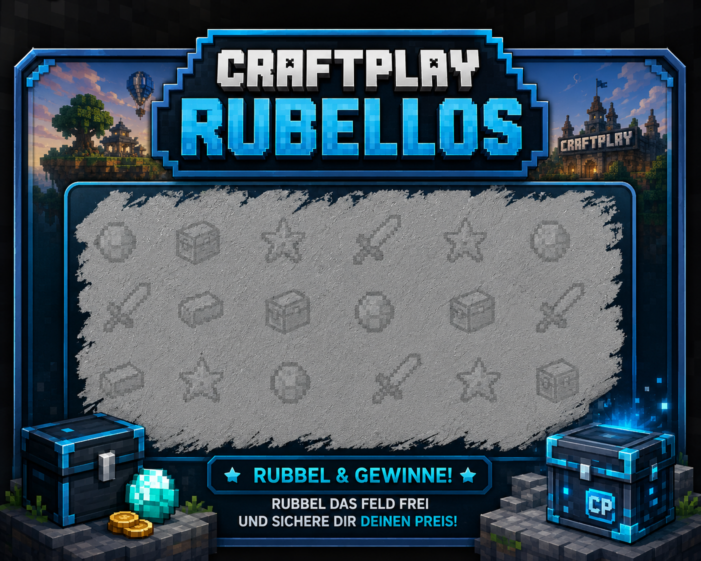
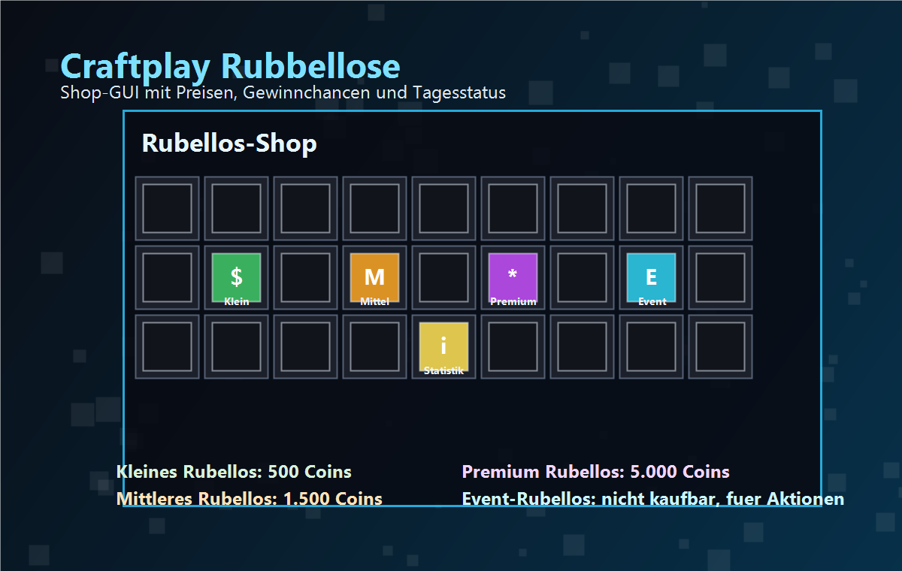
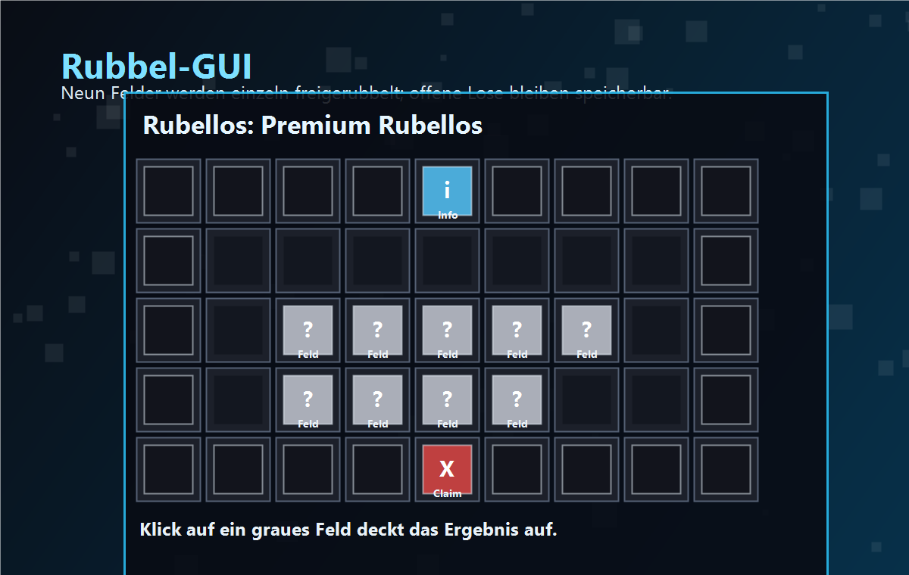
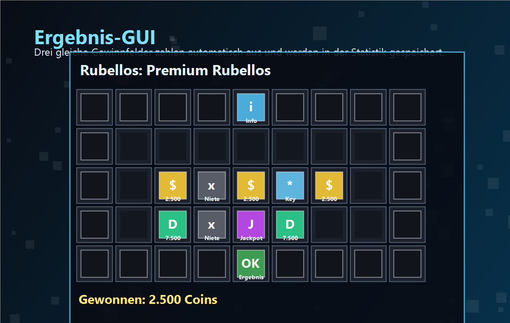
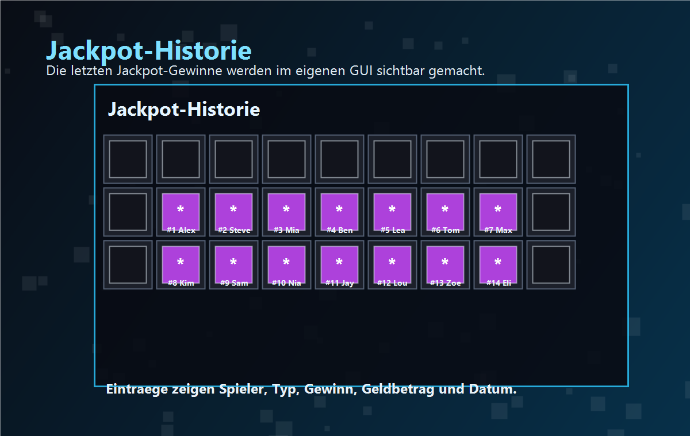

# Craftplay Rubbellose



**Craftplay Rubbellose** bringt ein vollwertiges Rubellos-System auf den Minecraft-Server. Spieler kaufen Rubellose im GUI-Shop, rubbeln die Felder direkt im Inventar frei und erhalten ihre Gewinne automatisch. Das Plugin arbeitet mit Vault-Economy, speichert Statistiken und offene Lose dauerhaft und kann wahlweise mit SQLite oder MySQL betrieben werden.

## Kurzer Ueberblick

| Bereich | Details |
| --- | --- |
| Plugin | Craftplay-Rubbellose |
| Version | 0.3.2 |
| Server | Paper/Purpur 1.21.x |
| Java | Java 21 |
| Wirtschaft | Vault + Economy-Plugin |
| Datenbank | SQLite standardmaessig, MySQL optional |
| Sprache | Deutsch und Englisch |
| Optional | PlaceholderAPI |

## Highlights

- GUI-Shop mit mehreren Rubellos-Typen
- animierter Start per Actionbar-Ladebalken
- echtes Rubbel-GUI mit neun verdeckten Feldern
- automatische Gewinnauszahlung nach drei gleichen Treffern
- Jackpot-Broadcasts und Jackpot-Historie
- Tageslimits fuer Kaeufe und Oeffnungen
- Besitzlimit fuer echte Plugin-Rubellose
- Persistenz: offene Rubellose bleiben nach Disconnect oder Restart erhalten
- Spieler- und Serverstatistiken
- PlaceholderAPI-Unterstuetzung fuer externe Anzeigen
- Admin-Befehle fuer Reload, Diagnose, Give und offene Lose
- Daily-Los, Lucky Hour, Streaks, Serien, Eventlose und Mystery-Multiplikator
- Rubellos-Pass, taegliche Quests, Serverziele, Gruppenziele, Pity-System und Risiko-Spiel
- Bedrock/Geyser-kompatible Command-Registrierung ohne Inventar-Item

## So Funktioniert Es

Spieler oeffnen den Shop mit `/rubbellos`, waehlen ein Rubellos aus und kaufen es mit Coins. Das gekaufte Rubellos liegt als echtes Plugin-Item im Inventar und kann per Rechtsklick geoeffnet werden.

Beim Oeffnen wird das Ergebnis sofort serverseitig berechnet und gespeichert. Danach oeffnet sich das Rubbel-GUI: Der Spieler deckt die Felder einzeln auf. Sobald genug Felder geoeffnet wurden, zeigt das Plugin das Ergebnis an und zahlt den Gewinn automatisch aus. Wird der Spieler getrennt oder der Server neu gestartet, kann das offene Rubellos mit `/rubbellos claim` fortgesetzt werden.

## GUI Bilder

### Shop-GUI



Im Shop werden die verfuegbaren Rubellos-Typen angezeigt. Jedes Los zeigt Preis, Gewinnchance und moegliche Gewinne. Die Statistik in der Mitte informiert ueber gekaufte und geoeffnete Lose, Tageslimits und Besitzlimit.

### Rubbel-GUI



Das Rubbel-GUI besteht aus neun verdeckten Feldern. Jedes Feld wird per Klick freigerubbelt. Das offene Los bleibt gespeichert, solange es noch nicht abgeschlossen wurde.

### Ergebnis-GUI



Nach dem Freirubbeln zeigt das Plugin das Ergebnis an. Drei gleiche Gewinnfelder loesen den Gewinn aus. Geldbetraege werden ueber Vault ausgezahlt, Command-Belohnungen werden direkt vom Server ausgefuehrt.

### Jackpot-Historie



Die Jackpot-Historie zeigt die letzten Jackpot-Gewinne mit Spieler, Rubellos-Typ, Gewinn, Geldbetrag und Datum.

## Standard-Rubbellose

| Typ | Anzeige | Preis | Kaufbar | Besonderheit |
| --- | --- | ---: | --- | --- |
| `small` | Kleines Rubellos | 500 Coins | Ja | guenstiger Einstieg mit kleinem Jackpot |
| `medium` | Mittleres Rubellos | 1.500 Coins | Ja | hoehere Gewinne und Rare-Key moeglich |
| `premium` | Premium Rubellos | 5.000 Coins | Ja | hohe Geldgewinne, Epic-Key und Premium-Jackpot |
| `event` | Event-Rubellos | 0 Coins | Nein | fuer Events, Giveaways oder Admin-Ausgabe |

Die Lose und Belohnungen werden in `rewards.yml` konfiguriert. Chancen werden gewichtet berechnet und muessen nicht exakt 100 ergeben.

## Wichtige Befehle

| Befehl | Beschreibung |
| --- | --- |
| `/rubbellos` | Shop oeffnen |
| `/rubbellos shop` | Shop oeffnen |
| `/rubbellos claim` | offenes Rubellos fortsetzen |
| `/rubbellos daily` | taegliches Gratis-Los abholen |
| `/rubbellos history` | eigene Gewinn-Historie anzeigen |
| `/rubbellos series` | Rubellos-Serien anzeigen |
| `/rubbellos pass` | Rubellos-Pass anzeigen |
| `/rubbellos quests` | taegliche Auftraege anzeigen |
| `/rubbellos board` | Jackpot-, Pass- und Ziel-Board oeffnen |
| `/rubbellos risk` | letzten Geldgewinn riskieren |
| `/rubbellos gift <spieler> <typ> <anzahl>` | eigene Lose verschenken |
| `/rubbellos jackpots` | Jackpot-Historie oeffnen oder anzeigen |
| `/rubbellos stats` | Serverstatistiken anzeigen |
| `/rubbellos info <spieler>` | Spielerstatistik anzeigen |
| `/rubbellos list` | geladene Rubellos-Typen anzeigen |
| `/rubbellos debug` | Diagnosewerte anzeigen |
| `/rubbellos resetpending <spieler>` | offenes Rubellos eines Spielers entfernen |
| `/rubbellos give <spieler> <typ> <anzahl>` | Rubellose an Spieler geben |
| `/rubbellos simulate <typ> <anzahl>` | Auszahlungen simulieren |
| `/rubbellos reload` | Config, GUI, Sprache und Rewards neu laden |
| `/scratchcard` | englischer Alias fuer `/rubbellos` |
| `/cpscratchdiag` | Diagnose zur geladenen Command-Version |

## Rechte

| Permission | Zweck |
| --- | --- |
| `craftplay.scratchcards.use` | Rubellose nutzen |
| `craftplay.scratchcards.shop` | Shop oeffnen |
| `craftplay.scratchcards.buy` | Rubellose kaufen |
| `craftplay.scratchcards.stats` | Statistiken anzeigen |
| `craftplay.scratchcards.give` | Rubellose geben |
| `craftplay.scratchcards.reload` | Plugin neu laden |
| `craftplay.scratchcards.admin` | Admin-Funktionen |

## Installation

1. Server stoppen.
2. `Craftplay-Rubbellose-0.3.2.jar` in den `plugins`-Ordner kopieren.
3. Vault und ein kompatibles Economy-Plugin installieren.
4. Server starten.
5. Dateien in `plugins/Craftplay-Rubbellose/` anpassen.
6. `/rubbellos reload` ausfuehren oder den Server neu starten.

## Konfiguration

Die wichtigsten Dateien liegen nach dem ersten Start im Plugin-Ordner:

| Datei | Zweck |
| --- | --- |
| `config.yml` | Sprache, Datenbank, Limits, Cooldowns und Ladebalken |
| `gui.yml` | Shop-GUI, Rubbel-GUI, Jackpot-Historie und Item-Anzeigen |
| `rewards.yml` | Rubellos-Typen, Preise, Chancen und Gewinne |
| `language_de.yml` | deutsche Nachrichten |
| `language_en.yml` | englische Nachrichten |

Standardmaessig nutzt das Plugin SQLite. Fuer groessere Server kann MySQL in `config.yml` aktiviert werden:

```yaml
database:
  use_mysql: true
```

Danach werden Host, Port, Datenbankname, Benutzername und Passwort im MySQL-Block eingetragen.

## Bedrock Und Geyser

Bedrock-Spieler nutzen dieselben Befehle wie Java-Spieler. `/rubbellos` wird zusaetzlich ueber Papers Brigadier-Command-System registriert, damit Geyser den Command sauber an Bedrock-Clients ausliefern kann. Es gibt kein festes Menue-Item im Inventar; nur gekaufte oder erhaltene Rubellose landen dort.

## Sicherheit Und Persistenz

Craftplay Rubbellose markiert echte Lose ueber den PersistentDataContainer. Umbenanntes Papier wird deshalb nicht akzeptiert. Das Rubellos-Item wird beim Start des Rubbelvorgangs entfernt, das Ergebnis wird sofort berechnet und gespeichert. Die Animation im GUI ist nur die Darstellung fuer den Spieler.

Pro Spieler ist nur ein offenes Rubellos erlaubt. Offene Lose werden in der Datenbank gespeichert und koennen nach Disconnect oder Restart mit `/rubbellos claim` fortgesetzt werden. Admins koennen fehlerhafte offene Lose mit `/rubbellos resetpending <spieler>` bereinigen.

## PlaceholderAPI

Wenn PlaceholderAPI installiert ist, stehen diese Platzhalter zur Verfuegung:

| Placeholder | Bedeutung |
| --- | --- |
| `%cpsc_opened%` | geoeffnete Rubellose |
| `%cpsc_bought%` | gekaufte Rubellose |
| `%cpsc_won_money%` | insgesamt gewonnenes Geld |
| `%cpsc_jackpots%` | gewonnene Jackpots |
| `%cpsc_best_win%` | bester Gewinn |

## Empfohlener Testablauf

1. `/rubbellos debug`
2. `/rubbellos list`
3. `/rubbellos give <deinName> small 1`
4. Rubellos per Rechtsklick oeffnen
5. Ladebalken pruefen
6. alle Felder im GUI freirubbeln
7. Auszahlung und Datenbankeintrag pruefen
8. `/rubbellos stats`
9. `/rubbellos info <deinName>`

## Fehlerbehebung

Wenn Kaufen nicht moeglich ist, sollte zuerst `/rubbellos debug` ausgefuehrt werden. Steht dort bei Vault-Economy `nicht gefunden`, ist zwar Vault installiert, aber kein Economy-Plugin als Vault-Provider registriert. In diesem Fall Economy-Plugin pruefen, installieren oder den Server neu starten.

Wenn alte Command-Mappings aktiv sind, hilft ein kompletter Serverneustart. Das Plugin entfernt alte oder deaktivierte Legacy-Zuordnungen fuer `/rubellos` und registriert `/rubbellos`, `/scratchcard` und `/cpscratchdiag`. Ein sauberer Neustart ist trotzdem die stabilste Loesung.
